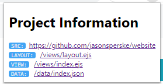

# View-Project-Src
A simple Chrome extension that turns project-src-* meta tags into a helpful UI.
The View-Project-Src project is a simple HTML native approach to making the
structure behind web applications more visible to people who are curious about
how the web works.

Generating view-project-src tags is easy (and completely flexible).  All tags must appear in the `<head>` secion of your HTML document.  All tags are optional but the primary tag is simply:

    <meta name="project-src" content="[URL]"/>

This tag lets anyone who is viewing the application know where they can find the project src.  This can be a project page, a readme, the sourcecode inside of a CMS, anything that would help direct a curious person.  This tag has no impact on the layout of the page, and has a minimal impact on the overall size or complexity of any web project.  However if you like it is posible to go further and reveal the structure of any URL with a component tag.

Component Tags
==============

Component tags are a simple way to reveal the inner structure of a composed web page.  The form of a component tag is as follws:

    <meta name="project-src-component" content="[COMPONENT OBJECT]"/>

A compoent object is a simple JSON with the following form:

    {"[TYPE]":"[URL or URL FRAGMENT]"}

The plug-in tries to be as flexible as browser's JS console in allowing single or double quotes arround JSON elements.  A `TYPE` can be anything and have any meaning to you or your organization, and the URL can be a full URI or just a meaningful part of a URL to help point someone in the rigth direction.  You can also hide a common URL base from all of these components by defining the following tag:

     <meta name="project-src-base" content="[URL]"/>

This tag will get added to all URL_FRAGMENTS making them clickable.  The screenshot above was generated from http://jason.spreske.com which contians the follwoing project-src tags:

    <meta name="project-src" content="https://github.com/jasonsperske/website"/>
    <meta name="project-src-base" content="https://github.com/jasonsperske/website/blob/master"/>
    <meta name="project-src-component" content="{'LAYOUT':'/views/layout.ejs'}"/>
    <meta name="project-src-component" content="{'VIEW': '/views/index.ejs'}"/>
    <meta name="project-src-component" content="{'DATA': '/data/index.json'}"/>
